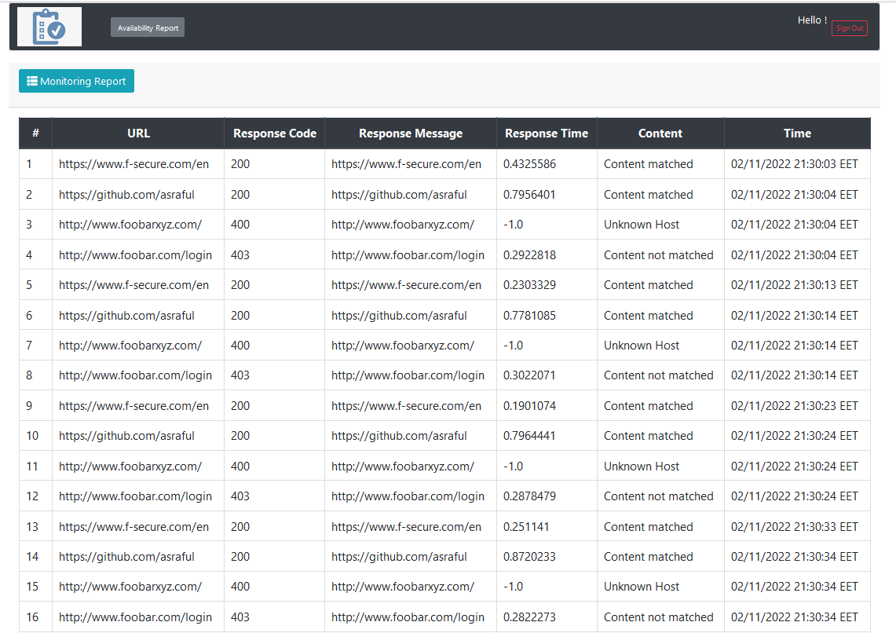

# availability-reporter
Check availability of websites

## User
* In-memory user added
* User name : admin. Password: admin
* User can log in and access the application
* http://localhost:5001/app/dashboard

## Configuration
*  Endpoints can be added : src/main/resources/endpoints.yaml
*  Periodic call configuration :  application.properties , monitor.call.period=10000

## Main Features
*  Reads a list of web pages (HTTP URLs) and corresponding page content requirements from a configuration file.
   * Implemented : Yes
*  Periodically makes an HTTP request to each page.
    * Implemented : Yes
*  Verifies that the page content received from the server matches the content requirements.
    * Implemented : Yes
*  Measures the time it took for the web server to complete the whole request.
    * Implemented : Yes
*  Writes a log file that shows the progress of the periodic checks.
    * Implemented : Yes
*  (OPTIONAL) Implement a single-page HTTP server interface in the same process that shows (HTML) each monitored web site and their current (last check) status.
    * Implemented : Yes
* Structure your code : Yes
* Use best practises : Yes
* Use naming conventions : yes
* Show understanding of software development concepts : yes

## Features
*  Monitoring matrix : monitoring_matrix.csv
*  Visual representation of monitoring report in dashboard

## Technical
* Language: Java 11
* Framework for backend and rest endpoint : Spring Boot
* Framework for DAO : Not used in this case, can be used Spring Data JPA
* jsoup used for DOM parsing.
* Lomobk used to reduce code footprint
* log4j/slf4j added for logging
* Build Environment:Maven
* Server: Inbuilt Tomcat
* Front End : Thymeleaf as Template Engine,BottStrap for styling

